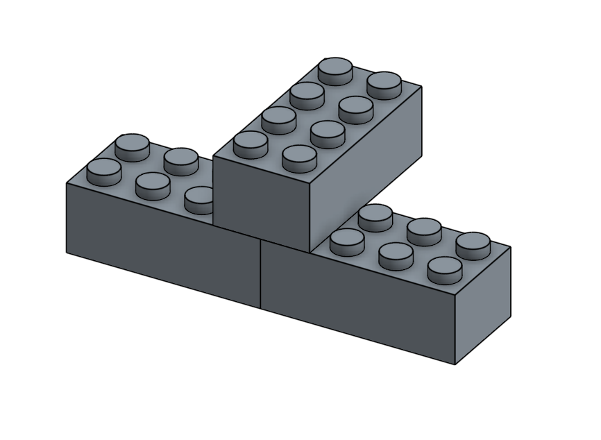

# Assembly

## Planar Mate

Select plane 1

Select plane 2

Type in offset (if needed)

## Assembling Legos

# Problem Solving

You have 3 pingpong balls which are rolling around your desk annoyingly. Let's fix this problem. Make a container that can hold these balls in place.

# Creative Making

Make a trophy! Be creative!
