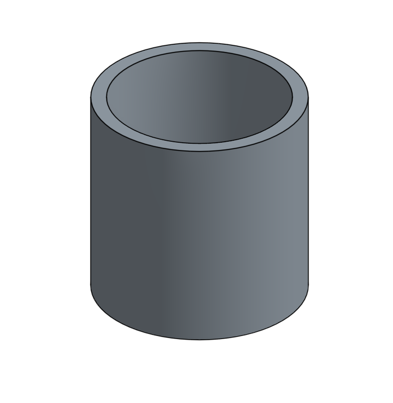
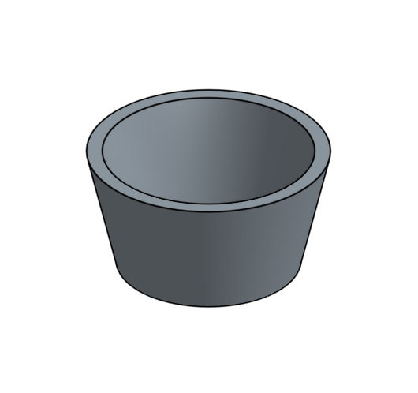
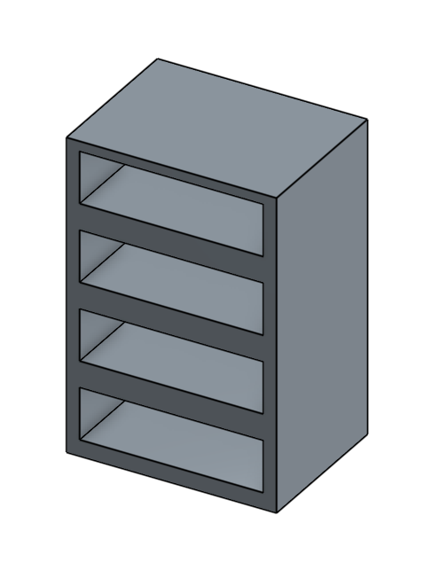
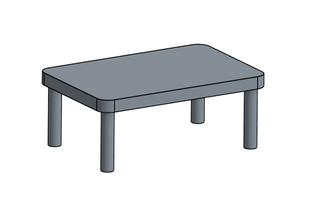
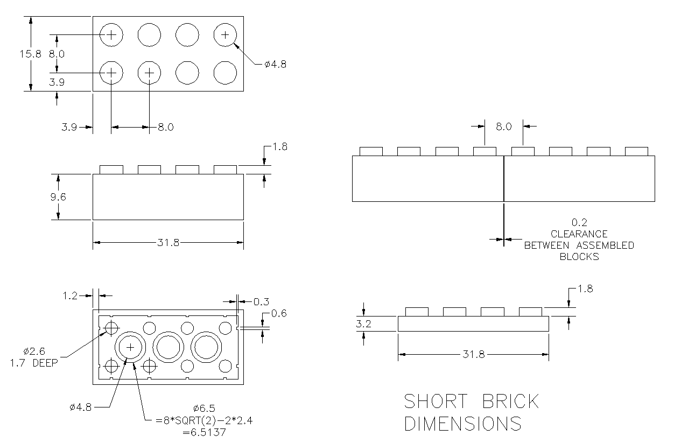

# Part Making

## Draw 2D Sketch

Click “sketch” button

Select sketch shape (rectangle, circle, ellipse, polygon etc)

## Extrude

Click "extrude" button

Select 2D sketchd plane

Type in height

## Negative Extrude / Shell

Negative Extrude: Type in negative number for extrude height

Shell: Click "shell" button and select face to extrude

## Revolve

Click "revolve" button

Select sketch and axis

## Pattern

Click "pattern" button

Choose type of pattern

Select solid to copy (use "Feature Pattern" not "Part Pattern")

Select axis and direction: click on edge of the solid

Type in distance

# Practice Exercise

## Basics

## Lego

