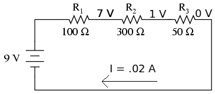
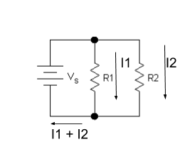

#Circuit Basics

Here, we'll introduce the fundamentals of circuits. It's a lot of information (usually over a week to cover similar material in a normal course), so don't worry if you don't pick everything up. The point is to give you guys an intuition on how circuits work.

What is a circuit? A circuit allows the flow of electricity between wires and components. For example, when you switch on a lightbulb, you are interacting with a circuit to let the electricity flow to the lightbulb. To describe circuits, electrical engineers use something called circuit diagrams. Here is an example of one:

## Components

### Wire

The most basic component of a circuit is a wire, which lets electricity flow uninhibited. When electricity flows through a circuit, we call it "current". In circuit diagrams, wires are drawn as straight lines.

###Voltage Source

This provides power(voltage) to the circuit. In circuit diagrams, they look like this:

 

In real life, these are things like batteries. In this workshop, you'll be using AA batteries as voltage sources.

### Resistor

The next most basic component is a resistor. Resistors look like this:

And the circuit diagram symbol for a resistor looks like a zig zag line: 

Resistors restrict the flow of electricity. 

### LED

LED stands for "Light Emitting Diode." They light up when current flows through them in the correct direction. They look like this:

And the diagram symbol looks like this:

____

Now that we have introduced some basic components, let's see how we can create circuits with them.

Here is a basic circuit.

In diagrams, we use the letter "I" to denote current, "R" for resistance, and "V" for voltage. As indicated in the diagram, current always flows from positive to negative. Let's say V = 3 Volts (Volts are a unit of voltage), and R = 3 Ohms (Ohms are a unit of resistance). To figure out what I is, we can use something called Ohm's Law.

### Ohm's Law

> V = IR

In any circuit, Ohm's Law is always true. So let's use it to find I in the previous circuit:

> 3 Volts = I * 3 Ohms  
> 3 Volts / 3 Ohms = 1 Ampere

We now know that I = 1 Ampere (Ampere is a unit of current). **The current is the same all throughout the circuit, unless there is a branch**. That is not always true of voltage.

Now we know everything about the circuit. We say we "solved the circuit."

### Series Circuits

Take a look at this circuit:

How do we solve this circuit for I? We have 3 resistors connected by wires in series. We can add them, then pretend it is one big resistor of that value. **Resistors in series add together.** So R1 + R2 + R3 = 450 Ohms. Now we use Ohm's Law again to find I:

> 9 V / 450 Ohms = .02 Amps

Like we said before, however, voltage is not the same throughout the circuit. Voltage "drops" across each resistor. How much does it drop by? We can use V=IR to find out!

Let's try R1 first. V = .02 * 100, so the voltage drop is 2 Volts. If we do the same for R2 and R3, we get V = 6 Volts and V = 1 Volt.

Okay, now how about this circuit?

This one has two resistors in parallel. In this case, current splits into two, proportionally. **We can treat the two parallel resistors like a resistor of equivalent value**:

> 1 / R = (1 / R1) + (1 / R2)

And now we use V=IR to find I. Let's say Vs = 10 Volts, R1 = 3 Ohms, and R2 = 1 Ohm. 

> R = 1 / (3 + 1) = 1/4 = .25 Ohms  
> I = 10 * .25 = 2.5 Amps

Now the interesting part is that more current goes through R2, since it has a lower resistance. To calculate it, use the following formula:

> I2 = I * R1 / (R1+R2)

So in the example above, this would be:

> I2 = 2.5 * 3 / (3 + 1) = 7.5 / 4 = 1.875 Amps

The same for the other resistor:

> I1 = 2.5 * 1 / (3 + 1) = 2.5 / 4 = 0.625 Amps

Note that I1 + I2 = 2.5 Amps, what we calculated before for I. This is also always true. 

##Conclusion

We saw different kinds of components, and how they interact to form circuits. We also saw how to solve them for values we're interested in. Don't worry if it all didn't make sense; this is a lot of information to take in at once, so make sure you ask questions! Now try solving some of the circuit problems on the next page.