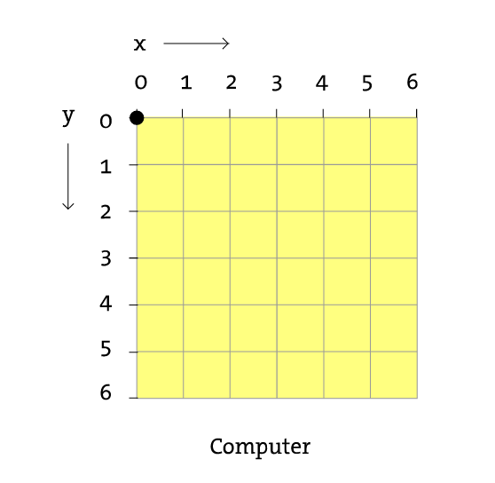
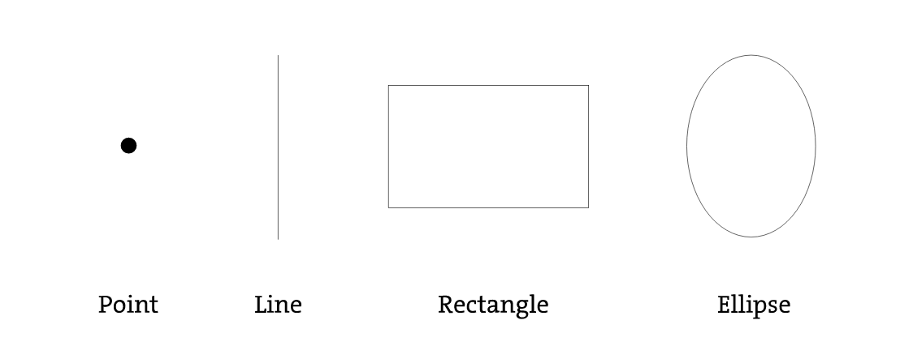
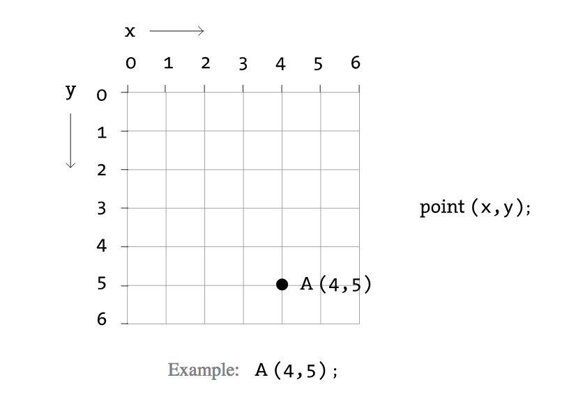
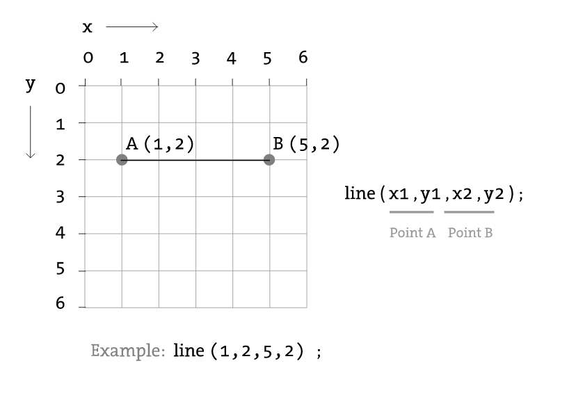
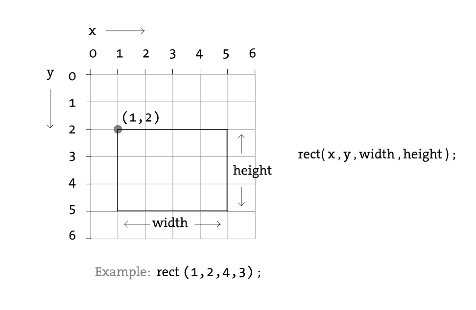
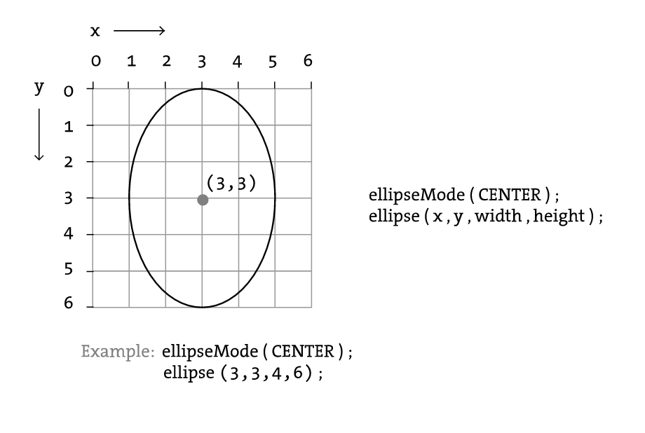
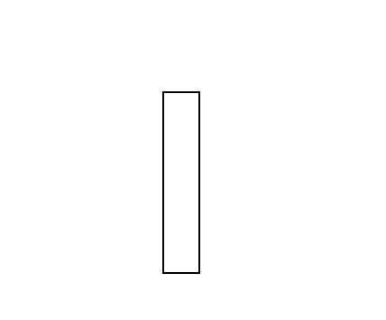
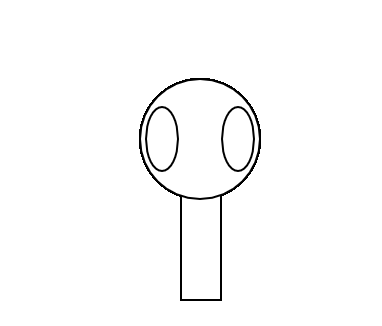
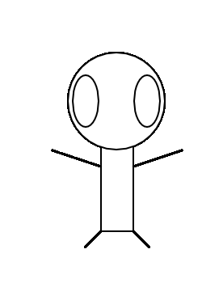
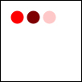

# Coding with Processing

## Using openprocessing.org

Go to [openprocessing.org](https://www.openprocessing.org). Click "Join & Create". Create an account.  

Now click "Create a Sketch".

## Coordinate Systems  

(0, 0) is in the top left corner. It increases in both directions.



## Drawing Shapes  

Now we will learn how to draw shapes:  



## Drawing Points  

Points are simple to draw. We only need an x and y coordinate.



## Drawing Lines  
Lines require two coordinates:  

  

## Drawing Rectangles  

A rectangle requires the top left corner location and its width and height.



## Drawing Ellipses  

To draw an ellipse, provide the center point and the width and height.



## Drawing 

Try running the following code: 

First, we will draw a rectangle:  

```java
function setup() {
  createCanvas(windowWidth, windowHeight);
} 

function draw() {
rect(90,50,20,100);
}
```  



Next, lets draw some ellipses:  

```java
function setup() {
  createCanvas(windowWidth, windowHeight);
} 

function draw() {
rect(90,50,20,100);
ellipse(100,70,60,60);
ellipse(81,70,16,32); 
ellipse(119,70,16,32); 
}
```



Next, lets draw some lines:  

```java
function setup() {
  createCanvas(windowWidth, windowHeight);
} 

function draw() {
rect(90,50,20,100);
ellipse(100,70,60,60);
ellipse(81,70,16,32); 
ellipse(119,70,16,32); 
line(90,150,80,160);
line(110,150,120,160);
line(60,100,90,110);
line(110,110,140,100);
}
```



Now try making your own drawings!

## Colors  

To set the color, use the fill(r, g, b) command.


```java
function setup() {
  createCanvas(windowWidth, windowHeight); 
  background(100);
} 

function draw() {
  background(255);  

  // Bright red
  fill(255,0,0);
  ellipse(20,20,16,16);

  // Dark red
  fill(127,0,0);
  ellipse(40,20,16,16);

  // Pink (pale red)
  fill(255,200,200);
  ellipse(60,20,16,16);
}
```

  

## Using the Mouse

You can use your mouse by using **mouseX** and **mouseY** as variables. These variables have the coordinates of your mouse.

```java
function setup() {
  createCanvas(windowWidth, windowHeight); 
  background(100);
} 

function draw() {
  ellipse(mouseX, mouseY, 20, 20);
}
```

Now go and create something of your own!

If you want more reference, go to [https://processing.org/reference/](https://processing.org/reference/)


