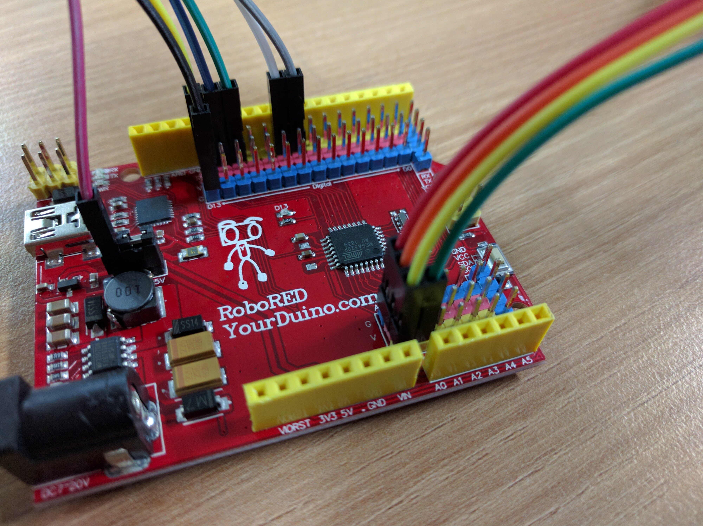

# Remote Control Circuit

## Add the Capacitor  


## Add the joystick   





## Add RF Module

| RF Chip Pin Name | RF Chip Pin Number | Arduino Pin |
| ---------------- | ------------------ | ----------- |
| GND              | 1                  | GND         |
| VCC              | 2                  | 3.3V        |
| CE               | 3                  | 7           |
| CSN              | 4                  | 8           |
| SCK              | 5                  | 13          |
| MOSI             | 6                  | 11          |
| MISO             | 7                  | 12          |
| IRQ              | 8                  |             |


## Add Servo  


# Code

## Controller  

Upload the following code to your remote controller:  

```c
// Code for controller

#include <RF24Network.h>
#include <RF24.h>
#include <SPI.h>

RF24 radio(7,8);                    // nRF24L01(+) radio attached using Getting Started board 

RF24Network network(radio);          // Network uses that radio

const int xAxis = A0;         // joystick X axis
const int yAxis = A1;         // joystick Y axis
int range = 100;               // output range of X or Y movement
int center = range / 2;       // resting position value
int threshold = range / 4;    // resting threshold

const uint16_t this_node = 01;        // Address of our node in Octal format
const uint16_t other_node = 00;       // Address of the other node in Octal format

const unsigned long interval = 20; //ms  // How often to send 'hello world to the other unit

unsigned long last_sent;             // When did we last send?
unsigned long packets_sent;          // How many have we sent already


struct payload_t {                  // Structure of our payload
  int x_axis_value;
  int y_axis_value;
};

void setup(void)
{
  Serial.begin(57600);
  Serial.println("RF24Network/examples/helloworld_tx/");
 
  SPI.begin();
  radio.begin();
  network.begin(/*channel*/ 90, /*node address*/ this_node);
}

void loop() {
  
  network.update();                          // Check the network regularly

  
  unsigned long now = millis();              // If it's time to send a message, send it!
  if ( now - last_sent >= interval  )
  {
    last_sent = now;

    Serial.print("Sending...");
    payload_t payload = { readAxis(xAxis), readAxis(yAxis) };
    RF24NetworkHeader header(/*to node*/ other_node);
    bool ok = network.write(header,&payload,sizeof(payload));
    if (ok)
      Serial.println("ok.");
    else
      Serial.println("failed.");
  }
}

/*
  reads an axis (0 or 1 for x or y) and scales the
 analog input range to a range from 0 to <range>
 */

int readAxis(int thisAxis) {
  // read the analog input:
  int reading = analogRead(thisAxis);

  // map the reading from the analog input range to the output range:
  reading = map(reading, 0, 1023, 0, range);

  // if the output reading is outside from the
  // rest position threshold,  use it:
  int distance = reading - center;

  if (abs(distance) < threshold) {
    distance = 0;
  }

  // return the distance for this axis:
  return distance;
}
```

## Code for Robot:  

Upload the following code to the Robot.  

```c
// Code for Robot

#include <RF24Network.h>
#include <RF24.h>
#include <SPI.h>

#define leftMotorA 2
#define leftMotorB 3
#define leftMotorEnable 9
#define rightMotorA 4
#define rightMotorB 5
#define rightMotorEnable 10

RF24 radio(7,8);                // nRF24L01(+) radio attached using Getting Started board 

RF24Network network(radio);      // Network uses that radio
const uint16_t this_node = 00;    // Address of our node in Octal format ( 04,031, etc)
const uint16_t other_node = 01;   // Address of the other node in Octal format

struct payload_t {                  // Structure of our payload
  int x_axis_value;
  int y_axis_value;
};

void stop() {
  digitalWrite(rightMotorEnable, LOW);
  digitalWrite(leftMotorEnable, LOW);
}

void leftWheel() {
digitalWrite(rightMotorA, HIGH);
digitalWrite(rightMotorB, LOW);
digitalWrite(rightMotorEnable, HIGH);
digitalWrite(leftMotorA, LOW);
digitalWrite(leftMotorB, HIGH);
digitalWrite(leftMotorEnable, HIGH);

}

void rightWheel() {
  digitalWrite(rightMotorA, LOW);
digitalWrite(rightMotorB, HIGH);
digitalWrite(rightMotorEnable, HIGH);
digitalWrite(leftMotorA, HIGH);
digitalWrite(leftMotorB, LOW);
digitalWrite(leftMotorEnable, HIGH);
}

void forward() {
digitalWrite(leftMotorA, HIGH);
digitalWrite(leftMotorB, LOW);
digitalWrite(leftMotorEnable, HIGH);
  digitalWrite(rightMotorA, HIGH);
digitalWrite(rightMotorB, LOW);
digitalWrite(rightMotorEnable, HIGH);
}

void backward() {
  digitalWrite(leftMotorA, LOW);
digitalWrite(leftMotorB, HIGH);
digitalWrite(leftMotorEnable, HIGH);
  digitalWrite(rightMotorA, LOW);
digitalWrite(rightMotorB, HIGH);
digitalWrite(rightMotorEnable, HIGH);
  
}

void setup(void)
{
  Serial.begin(57600);
  Serial.println("RF24Network/examples/helloworld_rx/");
 
  SPI.begin();
  radio.begin();
  network.begin(/*channel*/ 90, /*node address*/ this_node);
  pinMode(leftMotorA, OUTPUT);
  pinMode(leftMotorB, OUTPUT);
    pinMode(rightMotorA, OUTPUT);
  pinMode(rightMotorB, OUTPUT);
  stop();
//  RobotDriver.init();
}


void loop(void){
  
  network.update();                  // Check the network regularly

  
  while ( network.available() ) {     // Is there anything ready for us?
    
    RF24NetworkHeader header;        // If so, grab it and print it out
    payload_t payload;
    network.read(header,&payload,sizeof(payload));
    Serial.print("Received packet");
    Serial.print(payload.x_axis_value);
    if (payload.x_axis_value > 10) {
      forward();
    } else if (payload.x_axis_value < -10) {
      backward();
    }
    else if (payload.y_axis_value > 10) {
      leftWheel();
    } else if (payload.y_axis_value < -10) {
      rightWheel();
    } else {
      stop();  
    }
  }
}
```


